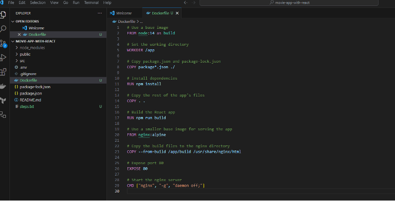

 
# PaCE@NTU SCTP Cohort 2 - Cloud Infrastructure Engineering

## Monitoring Large Applications (Site Reliability Engineering)

**Group 3**: Soo Wei Heng | Ren Peng | Sangeetha Thirumurugan | Ng Yu Yuan | Selvam S/O P Mohan

---

## TechWise Innovations Company Profile

At TechWise Innovations, we are pioneers in the field of enterprise software solutions, with a special focus on microservices architecture. We take pride in our team of Site Reliability Engineers (SREs) who play a critical role in ensuring early detection, enhancing observability, and guaranteeing system reliability.

- [Requirements Gathering](https://docs.google.com/spreadsheets/d/11J3PLi_lxMLwQo3EYkwIn_NQOdFA3hFcKvUAmc0bSTU/edit#gid=0)
- [Jira Board](https://sctp-cloud-cohort2-group3.atlassian.net/jira/software/projects/GCP/boards/1)

---

## Monitoring and Visualization

When it comes to visualizing metrics from every component of your system, the dynamic duo of Grafana and Prometheus reign supreme:

- **Grafana**: The visualization powerhouse that transforms Prometheus data into actionable insights.
- **Prometheus**: Your go-to monitoring solution for storing critical time series data, including vital metrics.

Together, they empower you to harness the full potential of your data, ensuring that you never miss a beat in your monitoring and visualization endeavors.

---

## Solution Architecture


---

## Movie App Project

The application team recently worked with an entertainment company specializing in streaming online media content to create a movie application. The movie app project used React components, router redirects, Firebase backend, and data pulled from an API with Axios.

- [GitHub Repository](https://github.com/Sule-Ss/movie-app-with-react)

The application was containerized using Docker and deployed to AWS Elastic Container Service.


### Cloning the Repository to Your Local Environment


```shell
git clone https://github.com/Sule-Ss/movie-app-with-react.git
cd movie-app-with-react
code .
```

### Create Dockerfile

```Dockerfile
# Use a base image
FROM node:14 as build

# Set the working directory
WORKDIR /app

# Copy package.json and package-lock.json
COPY package*.json ./

# Install dependencies
RUN npm install

# Copy the rest of the app’s files
COPY . .

# Build the React app
RUN npm run build

# Use a smaller base image for serving the app
FROM nginx:alpine

# Copy the build files to the nginx directory
COPY --from=build /app/build /usr/share/nginx/html

# Expose port 80
EXPOSE 80

# Start the nginx server
CMD ["nginx", "-g", "daemon off;"]
```

## Docker Commands
1. Open Docker Desktop and sign in.

2. Go back to your VS Code.

3. Build the Docker image with a tag (name) for the image:
```
docker build -t movie-app-image .
```
(The -t flag is used to tag or name the Docker image that is being built.)

4. Run the Docker container, mapping port 8080 on the host to port 80 in the container, and run it in detached mode:
```
docker run -p 8080:80 -d movie-app-image
```
(The -p flag is used to map or publish ports between the host and the container. For example, port 80 within the container will be mapped to port 8080 on the host machine. The -d flag is used to run a container in detached mode, which means the container runs in the background as a daemon process.)

5. Once you can deploy locally, you can proceed to deploy it on Amazon Elastic Container Service (ECS).

6. Build the Docker image again with the same tag (if needed) to ensure you have the latest image locally:
```
docker build -t movie-app-image .
```
7. The Docker image will be pushed to Amazon Elastic Container Registry (ECR). Ensure you are signed in to your AWS account via a web browser.

8. Obtain an ECR login password for the specified AWS region and log in to ECR using Docker:
```
aws ecr get-login-password --region ap-southeast-1 | docker login --username AWS --password-stdin 255945442255.dkr.ecr.ap-southeast-1.amazonaws.com
```

## Create a Repository in Amazon Elastic Container Registry (ECR)
1. Next, you need to create a repository in Amazon Elastic Container Registry (ECR) where you can store your Docker image.

2. Enter a unique name for your repository in the ECR console.

## Tag Docker Image with Amazon Elastic Container Registry
After creating the repository, you'll need to tag your Docker image with the ECR repository URL and a specific tag (e.g., "latest"). This is necessary for pushing the image to ECR.
```
docker tag movie-app-image:latest 255945442255.dkr.ecr.ap-southeast-1.amazonaws.com/movie-app-image:latest
```
(Replace "movie-app-image" with your image name and "latest" with your desired tag if different.)
